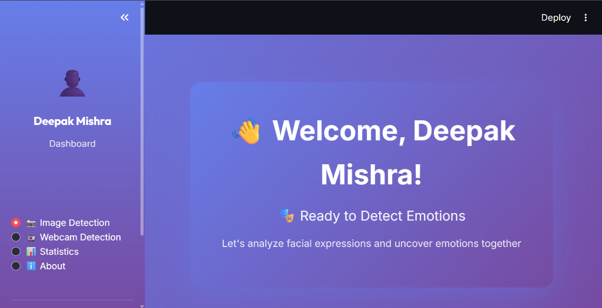

# 🎭 Facial Emotion Recognition System

Hey there! 👋 This is my B.Tech final year project. It's an AI system that can look at your face and tell you how you're feeling (or at least try to!).

I built this using **Python**, **TensorFlow**, and **Streamlit**. It uses a Convolutional Neural Network (CNN) trained on thousands of face images to recognize 7 different emotions: Happy, Sad, Angry, Surprise, Fear, Disgust, and Neutral.

## 🚀 Features

- **Webcam Detection**: See your emotions in real-time! (Pretty fun to play with)
- **Image Upload**: Upload a group selfie and see everyone's emotions.
- **Stats Dashboard**: Tracks your emotions over time (if you log in).
- **Dark Mode UI**: Because every developer loves dark mode.

## 🛠️ Tech Stack

- **Language**: Python 3.8+
- **Deep Learning**: TensorFlow & Keras
- **Computer Vision**: OpenCV
- **Web App**: Streamlit
- **Visualization**: Plotly
- **Database**: SQLite (Simple and effective)

## 🏃‍♂️ How to Run It

1. **Clone this repo**:
   ```bash
   git clone https://github.com/deepmishra45321/Resume-Analyser.git
   cd "Image Recognization"
   ```

2. **Install the requirements**:
   ```bash
   pip install -r requirements.txt
   ```

3. **Run the app**:
   ```bash
   streamlit run main.py
   ```

4. **Open your browser**:
   Usually it's at `http://localhost:8501`.

## 🧠 The AI Model

I designed a custom CNN architecture for this. It has 4 convolutional blocks:
1.  **Block 1**: Catches basic edges and shapes.
2.  **Block 2**: Starts seeing eyes and eyebrows.
3.  **Block 3**: Focuses on the mouth and expressions.
4.  **Block 4**: Puts it all together.

I used **Batch Normalization** and **Dropout** to stop it from overfitting (memorizing the training data). It's not 100% perfect, but it gets most expressions right!

## 😅 Challenges I Faced

- **Lighting**: The model struggles a bit if the room is too dark.
- **Webcam Lag**: Getting real-time performance in the browser was tricky. I had to optimize the image processing pipeline.
- **Subtle Emotions**: Distinguishing between "Fear" and "Surprise" is surprisingly hard for an AI (and sometimes for humans too!).

## 📝 Future Plans

- [ ] Add support for video file uploads.
- [ ] Try to improve accuracy for "Fear" and "Disgust".
- [ ] Maybe add a music recommender based on your mood?

## 👨‍💻 About Me

**Deepak Mishra**  
B.Tech in AI & ML | 2025  

I love building things with AI. If you have any questions or just want to chat about deep learning, hit me up!

- **LinkedIn**: [Connect with me](https://www.linkedin.com/in/deepak-mishra-a86623287)
- **GitHub**: [Check out my code](https://github.com/deepmishra45321)

---
*Thanks for checking out my project! ⭐*
